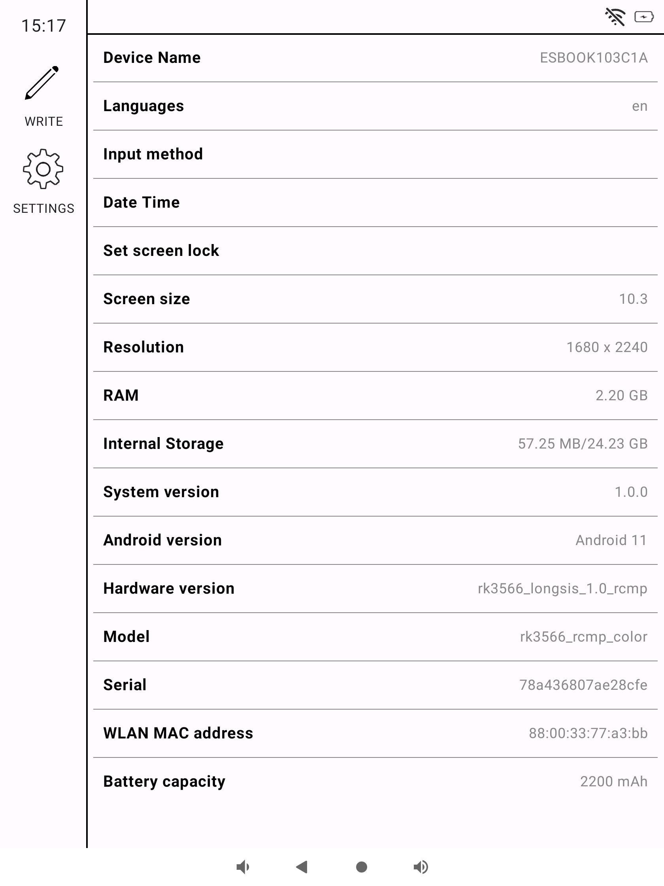

# About ESBook
EsBook is a device specifically designed for e-paper application development, offering powerful performance and an easy learning curve. Click the link below to get your development toolkit now and create stunning e-paper applications!

https://item.taobao.com/item.htm?id=971200577187

# About EsLauncher

The EsLauncher app, part of the ESBook ecosystem, is primarily designed for display the homepage.

# GRADLE Configuration

If you are not in China, please modify the following configuration:
## settings.gradle.kts
Remove `maven.aliyun.com` from the repositories
## gradle-wrapper.properties
`distributionUrl=https\://mirrors.cloud.tencent.com/gradle/gradle-x.y.z-all.zip` 
modify to 
`distributionUrl=https\://services.gradle.org/distributions/gradle-x.y.z-bin.zip`